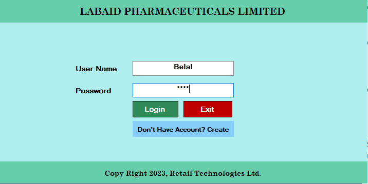
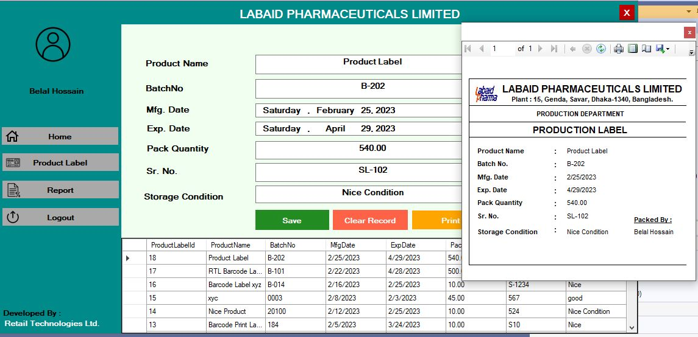

## Hi, I am Md. Ballal Hossain
> I’m a Software Developer specializing in building Web & Desktop Applications. I love building Application Using ASP.NET 6+ (Windows Form,WPF, Web Form, MVC & CORE ) Framework.  As for the backend, I work with `ASP.NET Core WebAPIs` & `SQL` following Clean Architecture Principles. 

## Label Printing Software
- 👉 This is Product Label Printing Software. 
- 👉 Design Template Of Label (Size, Color, Height, Width, Font) & Number of Template is Designed as per Customer Requirement. 
- 👉 User Can Input Product Label Data which data will be change dynamically On Predefined Template, Save Record & Print Label.
- 👉 Can Track Which Label Print is Printed by Which User.
- 👉 User Can Re-Print Product Label from Recorded Data.
- 👉 Can view User wise Report of Printed Product Label With Date Range.

#### Project Screen Shot 💻
- Login Page

- Dashboard & Label Print View

<!--
Here are some ideas to get you started:

- 🔭 I’m currently working on ...
- 🌱 I’m currently learning ...
- 👯 I’m looking to collaborate on ...
- 🤔 I’m looking for help with ...
- 💬 Ask me about ...
- 📫 How to reach me: ...
- 😄 Pronouns: ...
- ⚡ Fun fact: ...
-->
